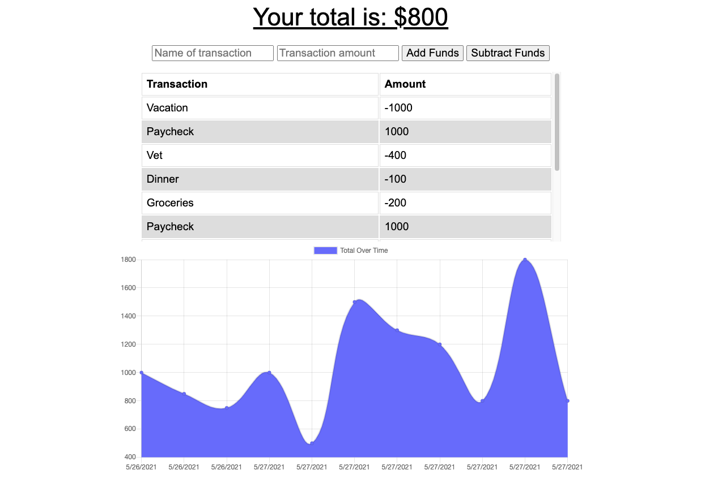

# Budget Tracker
A full stack heroku deployed application that allows you to keep track of your finances, whether online or off.
## Table of Contents
- [Deployment](#deployment)
- [Visuals](#visuals)
- [License](#license)
- [Authors](#authors)
## Deployment
This app is deployed on Heroku, and is available for complete use [here](https://vast-sierra-24442.herokuapp.com/). It can also be run locally directly out of this repository. If you would like to go that route, please visit the installation section below.
## Visuals

## License
This project is licensed under the MIT license. Please visit [the license file](https://github.com/lbburnsy/note-taker/blob/main/LICENSE) for more info.
## Authors
[Luc Burns](https://github.com/lbburnsy)